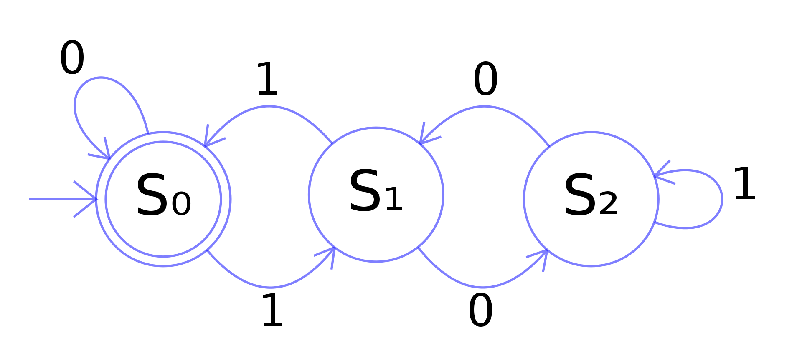
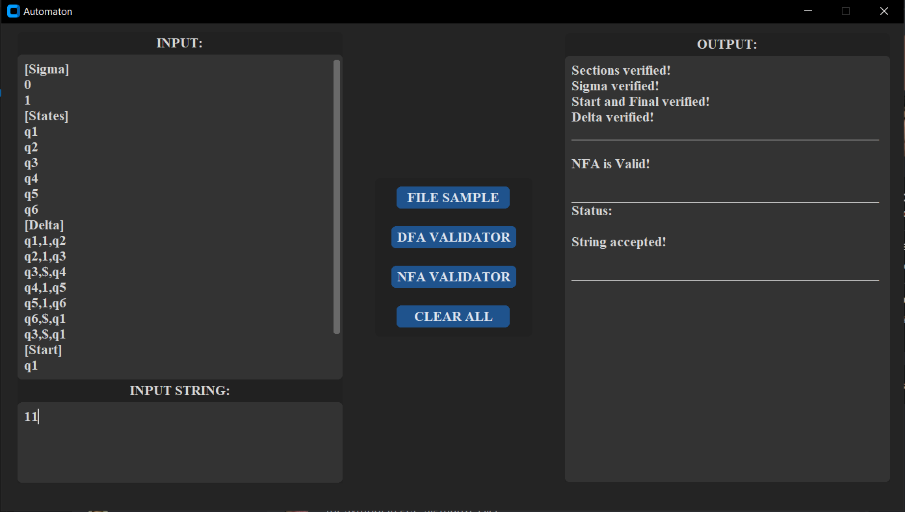
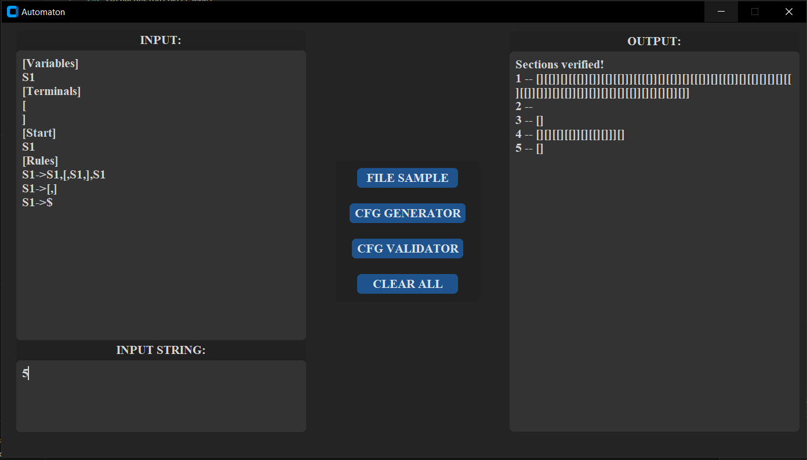
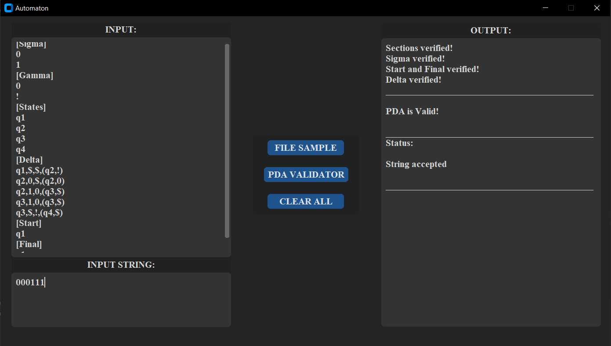

## **Table of contents:**
- [Description](#description)
- [Contributors](#contributors)
- [Usage](#usage)
- [Gallery](#gallery)
  - [NFA\_DFA](#nfa_dfa)
  - [CFG](#cfg)
  - [PDA](#pda)

# Description
Made in Python using VSCode.

This project implements various types of automata, including Deterministic Finite Automaton (DFA), Non-deterministic Finite Automaton (NFA), Context-Free Grammar (CFG), and Pushdown Automaton (PDA).

The project has the following implementations:
- DFA Validator
- NFA Validator
- CFG Generator
- PDA Validator

All the implementations have 2 forms : with GUI and with NO_GUI (for better perfomance)

# Contributors 
**All members are part of group 143.**
- Huma Stefan - stefan-dorian.huma@s.unibuc.ro
- Razvan Gabroveanu - razvan-petru.gabroveanu@s.unibuc.ro

# Usage
1. Clone the project repository from GitHub: https://github.com/Steven23X/Theory_of_Computation_Projects

2. Install the required dependencies. You can use pip to install the necessary packages by running the following command:
   ```
    pip install -r requirements.txt
   ```

3. **!IMPORTANT** to run the app don't open the entire folder in the IDE.

    Example: If you want to use the PDA with NO_GUI open just this folder:
        ```
        Theory_of_Computation_Projects/PDA/NO_GUI
        ```
    and run it normally

4. Side note : If you want to use the GUI form of the implementation open the correct folder and press **F5** (you need to use VSCode).


# Gallery

## NFA_DFA




## CFG



## PDA

